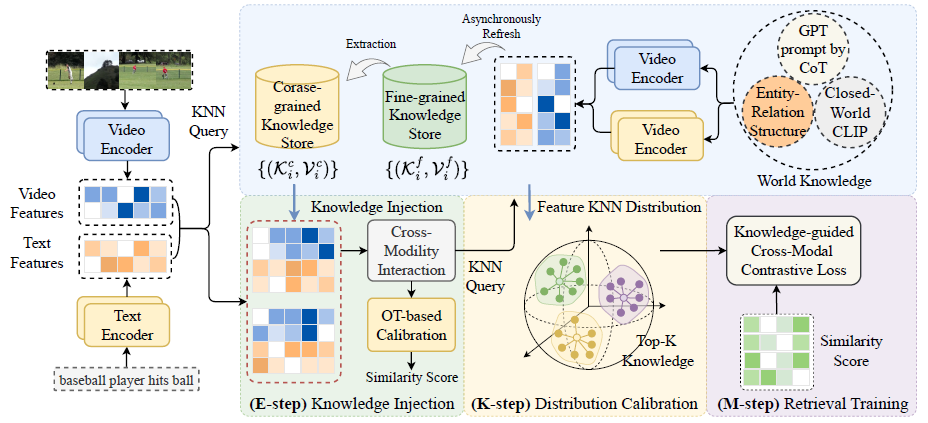

# [ECCV 2024] KDProR: A Knowledge-Decoupling Probabilistic Framework for Video-Text Retrieval

## Overview
The implementation of **KDProR: A Knowledge-Decoupling Probabilistic Framework for Video-Text Retrieval**.

> KDProR explores a novel knowledge-decoupling VTR paradigm that utilizes multi-grained knowledge stores to unify closed- and open-world knowledge.
This strategy, with our principled EKM algorithm, allows VTR models to achieve an efficient balance between memorization and retrieval optimization, while also opening up a unified interface for injecting various open-world knowledge.
Our model achieves SOTA results on MSR-VTT, LSMDC, ActivityNet, and DiDeMo under both close-set and open-set settings.

  

  

##  Log

[2024.09.25] The project repository is created.

[2024.07.04] Our paper is accepted by ECCV2024!

---

The code will be released when it's tidied up. Stay tuned.

### Acknowledgments
Thanks for these projects: [DRL](https://github.com/foolwood/DRL), [CLIP4clip](https://github.com/ArrowLuo/CLIP4Clip), [EMCL](https://github.com/jpthu17/EMCL/tree/main), [CLIP-ViP](https://github.com/microsoft/XPretrain/tree/main/CLIP-ViP), [SceneGraphParser](https://github.com/vacancy/SceneGraphParser/tree/master), etc.