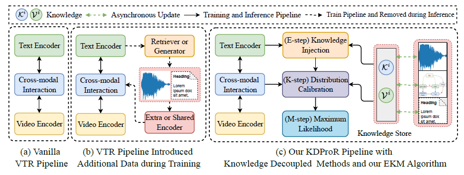

# [ECCV 2024] KDProR: A Knowledge-Decoupling Probabilistic Framework for Video-Text Retrieval

## Overview
The implementation of **KDProR: A Knowledge-Decoupling Probabilistic Framework for Video-Text Retrieval**.

> KDProR explores a novel knowledge-decoupling VTR paradigm that utilizes multi-grained knowledge stores to unify closed- and open-world knowledge.
This strategy, with our principled EKM algorithm, allows VTR models to achieve an efficient balance between memorization and retrieval optimization, while also opening up a unified interface for injecting various open-world knowledge.
Our model achieves SOTA results on MSR-VTT, LSMDC, ActivityNet, and DiDeMo under both close-set and open-set settings.

<p align="center">
  
</p>
<p align="center">
  
</p>

##  Log

[2024.12.24] Our code is published.

[2024.09.25] The project repository is created.

[2024.07.04] Our paper is accepted by ECCV2024!


---


## 1. Environmental installation, Weights and Datasets Download

### 1.1 Settings
```shell
conda create -n kdpror python=3.9
conda activate kdpror
pip install -r requirements.txt -i https://pypi.tuna.tsinghua.edu.cn/simple/
pip install torch==2.0.1+cu117 torchvision==0.15.2+cu117 -f https://download.pytorch.org/whl/torch_stable.html

```

### 1.2 Download CLIP Model 

```shell
cd main_model/models
wget https://openaipublic.azureedge.net/clip/models/40d365715913c9da98579312b702a82c18be219cc2a73407c4526f58eba950af/ViT-B-32.pt
wget https://openaipublic.azureedge.net/clip/models/5806e77cd80f8b59890b7e101eabd078d9fb84e6937f9e85e4ecb61988df416f/ViT-B-16.pt

```
### 1.3 Datasets
We use the same dataset and data preprocessing strategy as [CLIP4clip](https://github.com/ArrowLuo/CLIP4Clip).

For **MSRVTT**

You can download the splits and captions by,
```
wget https://github.com/ArrowLuo/CLIP4Clip/releases/download/v0.0/msrvtt_data.zip
```
Besides, the raw videos can be found in sharing from Frozen️ in Time, i.e.,
```
wget https://www.robots.ox.ac.uk/~maxbain/frozen-in-time/data/MSRVTT.zip
```
**LSMDC**, **ActivityNet**, and **DiDeMo** can be obtained from [datasets](https://github.com/ArrowLuo/CLIP4Clip)

## 2. Knowledge Generation

### 2.1 Closed-set Knowledge
You need to first replace the main file `main.py` in directory a with file `knowledge_gen/store_build/fine_grained_knowledge_gen.py`

Then, your have to modify the output file paths  and  model weight path in `fine_grained_knowledge_gen.py`.

Finally, you can run the following script to obtain a fine-grained knowledge store:
```shell
bash scripts/KDProR_stores_building.sh
```
You can further obtain the corase-grained knowledge store via the script `knowledge_gen/store_build/coarse_geained_knowledge_gen.py`.

If you want to use fine-tuning CLIP to construct a knowledge base, you need to first run the script `scripts/KDProR_msrvtt_baseline.sh` with 5 epochs and then use the saved weights to extract training set features and construct knowledge stores.

### 2.2 Pretraining Knowledge
You can download and prepare the CLIP-VIP project from here [CLIP-ViP](https://github.com/microsoft/XPretrain/tree/main/CLIP-ViP).

Furthermore, you can refer to the script `knowledge_gen/pre_gen/gen_pretraining_captions.py` to extract video and text features, and then maintain the same format of knowledge stores as the closed-set knowledge in 2.1.

Finally, you can further obtain the corase-grained knowledge store via the script `knowledge_gen/store_build/coarse_geained_knowledge_gen.py`.

### 2.3 Structured Knowledge
You can refer to the [SceneGraphParser](https://github.com/vacancy/SceneGraphParser/tree/master) to install the relevant runtime environment. 
And you can achieve scene image parsing and structured subtitle extraction by running the provided script as:
```
python knowledge_gen/graph_gen/gen_scene_caption_msrvtt.py
```
Extracting complete structures may take some time, depending on the performance of your machine.

Finally, you can use a method similar to closed set knowledge construction to extract multi-grained knowledge stores.

### 2.4 CoT Knowledge
You can use the script we provide to construct chain assisted subtitles generated by ChatGPT as:
```
python knowledge_gen/gpt_gen/gen_gpt_caption_msrvtt.py
```
You may need to spend 6-8 hours to construct auxiliary knowledge, depending on your network situation and OpenAI services.

Finally, you can use a method similar to closed set knowledge construction to extract multi-grained knowledge stores.

## 3. How to Run
We provide the core code of KDProR in ``main_model/``, and you can refer to the specific implementation of our method.

You can train the KDProR using the following script provided in `scripts/KDProR_msrvtt.sh`:
```shell
DATA_PATH="YOUR PATH"
CUDA_VISIBLE_DEVICES=0,1,2,3,4,5,6,7 \
python -m torch.distributed.launch \
--master_port 6089 \
--nproc_per_node=8 main.py \
--do_train 1 \
--workers 8 \
--n_display 50 \
--epochs 5 \
--lr 1e-4 \
--coef_lr 1e-3 \
--batch_size 128 \
--batch_size_val 128 \
--anno_path ${DATA_PATH}/ \
--video_path ${DATA_PATH}/MSRVTT_Videos \
--datatype msrvtt \
--max_words 32 \
--max_frames 12 \
--video_framerate 1 \
--base_encoder ViT-B/32 \
--agg_module seqTransf \
--interaction wti \
--wti_arch 2 \
--output_dir ckpts/ckpt_KDProR_MSR-VTT \
--knowledge_scale 0.2 \
--lambda_1 0.2 \
--lambda_2 0.3 \
--model_type KDProR
```
Logs and results will be saved at `output_dir`.


### Acknowledgments
Thanks for these projects: [DRL](https://github.com/foolwood/DRL), [CLIP4clip](https://github.com/ArrowLuo/CLIP4Clip), [EMCL](https://github.com/jpthu17/EMCL/tree/main), [CLIP-ViP](https://github.com/microsoft/XPretrain/tree/main/CLIP-ViP), [SceneGraphParser](https://github.com/vacancy/SceneGraphParser/tree/master), etc.

